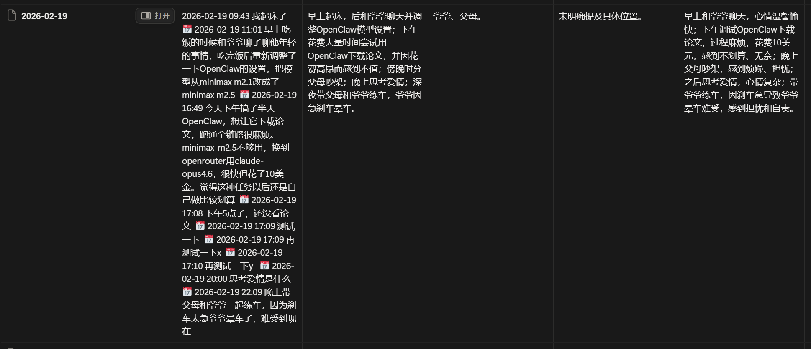

# LifeLog - Automated Life Logging System

[English](./README_EN.md) | [中文](./README.md)

> ⚠️ **Notice**: This skill and its documentation are AI-generated. For reference only.

Automatically record daily life to Notion, with intelligent date recognition and automatic summary analysis.

## Features

- 🤖 **Smart Date Recognition** - Automatically recognize "yesterday", "day before yesterday", etc., and log to the corresponding date
- 🔁 **Backfill Marker** - Non-same-day entries are marked as "🔁补录" (backfilled)
- 📝 **Real-time Logging** - Record life moments anytime, automatically saved to Notion
- 🌙 **Auto Summary** - Daily automatic LLM analysis to generate emotional state, main events, locations, and people

## Preview



## Quick Start

### 1. Install

Via ClawHub:
```bash
clawhub install lifelog
```

Or manually:
```bash
git clone https://github.com/421zuoduan/lifelog.git
```

### 2. Configure Notion

1. **Create Integration**
   - Visit https://www.notion.so/my-integrations
   - Click **New integration**
   - Copy the Token

2. **Create Database**
   - Create a new Database with fields (all rich_text type):
     - Date (title)
     - Original Text
     - Emotional State
     - Main Events
     - Location
     - People
   - Click **...** in the top right → **Connect to** → Select your Integration

3. **Get Database ID**
   - Extract from URL: `notion.so/{workspace}/{database_id}?v=...`

4. **Update Script Configuration**
   - Edit scripts in `scripts/`, replace:
     ```bash
     NOTION_KEY="your_token"
     DATABASE_ID="your_database_id"
     ```

### 3. Usage

```bash
# Log today's events
bash scripts/lifelog-append.sh "Had fried dough sticks for breakfast"

# Log yesterday's events (auto-recognized)
bash scripts/lifelog-append.sh "Went to the supermarket yesterday"

# Log day-before-yesterday's events
bash scripts/lifelog-append.sh "Had dinner with friends the day before yesterday"
```

### 4. Set Up Scheduled Summary (Optional)

```bash
openclaw cron add \
  --name "LifeLog-DailySummary" \
  --cron "0 5 * * *" \
  --tz "Asia/Shanghai" \
  --session isolated \
  --message "Run LifeLog daily summary"
```

## Scripts

| Script | Function |
|--------|----------|
| `lifelog-append.sh` | Real-time message logging |
| `lifelog-daily-summary-v5.sh` | Pull original text for a date |
| `lifelog-update.sh` | Write back analysis results |

## Supported Date Expressions

- 今天/今日/今儿 (today) → current day
- 昨天/昨日/昨儿 (yesterday) → previous day
- 前天 (day before yesterday) → 2 days ago
- 明天/明儿 (tomorrow) → next day
- 后天 (day after tomorrow) → 2 days later
- Specific date: 2026-02-22, 2月22日

## ClawHub

This skill is published on ClawHub: https://clawhub.com/s/lifelog

## License

MIT
